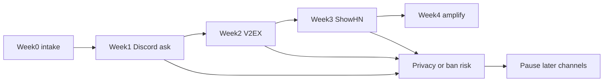

# Community launch plan

Research date: 2026-09-09
Last review: 2026-09-12
Status: drafts only. Every external post still needs a separate maintainer
approval. Do not publish from this document.

Visual briefing:
[community launch canvas](/C:/Users/bing1/.cursor/projects/d-cursor-projects-openclaw-memory-migrator/canvases/community-launch-plan.canvas.tsx).

## Goal

Recruit 3–8 self-hosted OpenClaw operators or plugin maintainers to submit
anonymized dry-run reconciliation summaries, compatibility failures, and
rollback notes.

Do not optimize the first wave for installs, stars, or virality.

## Launch baseline (2026-09-09)

| Surface | Value |
| --- | --- |
| GitHub repository | public, [airbing11/openclaw-memory-migrator](https://github.com/airbing11/openclaw-memory-migrator) |
| GitHub stars / forks / issues | 0 / 0 / 0 |
| Release `v0.1.0-rc.1` asset downloads | 0 |
| ClawHub `memory-core-migrator` installs | 0 |
| GitHub Discussions | disabled on this repository and on `openclaw/openclaw` |
| Issues | enabled; use Issue Forms as the only public intake |

## Funnel review (2026-09-12)

Observed after three days of public listing, with GitHub tester posts already
live and no Discord / V2EX / Show HN posts sent:

| Metric | 2026-09-09 | 2026-09-11 | 2026-09-12 |
| --- | --- | --- | --- |
| ClawHub downloads | 15 page / 0 API | 97 | 105 |
| ClawHub installs | 0 | 2 | 2 |
| ClawHub comments | 0 | 0 | 0 |
| GitHub stars | 0 | 1 | 1 |
| Issue #2 comments | 0 | 0 | 0 |
| Discussion #3 comments | 0 | 0 | 0 |
| Dry-run reports | 0 | 0 | 0 |

Diagnosis:

1. ClawHub discovery works. Downloads keep rising without outbound posts.
2. Install telemetry stays at 2. Most archive fetches are inspect, crawl, or
   unsigned-in installs.
3. Owned GitHub posts have almost no inbound traffic. They cannot recruit
   testers until a channel with operators points here.
4. The original README assumed the reader already had `export/main.json`. That
   is too high a first step for a ClawHub visitor.
5. Official Showcase now names `#self-promotion` and `@openclaw` as the
   submission path. Waiting for a moderator DM is no longer required for that
   specific channel:
   https://docs.openclaw.ai/start/showcase
6. Showcase entries that get listed are short, concrete, and include a demo or
   screenshot. Memory workflows are already an official category.

## Fact card

Use this card in every post. Do not invent additional claims.

- Product: OpenClaw Memory Migrator, a local-first Skill and CLI.
- Headline (EN): Move the memory. Keep the proof.
- Headline (ZH): 迁移记忆，不迁移风险。
- Audience: operators returning from third-party memory backends to official
  `memory-core`.
- Supported now:
  - stable: version-gated `memory-lancedb-pro` JSON capture;
  - stable: Markdown and QMD-owned Markdown;
  - beta: official `memory-lancedb` `ltm list` JSON in a versioned per-agent
    manifest;
  - target: `memory-core` Markdown plus official indexing.
- Safety contract: owner-only, dry-run first, verified backup, run-bound
  approval, fail closed on drift, no SQLite internals, no vector copy, no
  automatic deletion.
- Known limit: `memory-lancedb-pro` v1.1.0-beta.10 `export` is capped at 1,000
  records; compare every scoped export with fresh stats and paginate
  `list --offset` when required.
- Canonical links:
  - GitHub: https://github.com/airbing11/openclaw-memory-migrator
  - Release: https://github.com/airbing11/openclaw-memory-migrator/releases/tag/v0.1.0-rc.1
  - ClawHub: https://clawhub.ai/skills/memory-core-migrator
  - Dry-run form: https://github.com/airbing11/openclaw-memory-migrator/issues/new?template=dry-run-report.yml
  - Compatibility form: https://github.com/airbing11/openclaw-memory-migrator/issues/new?template=compatibility-bug.yml
- Single CTA: share an anonymized reconciliation summary through the Issue Form.

## Privacy redlines

Never request or accept:

- raw memory text, conversation logs, or daily notes;
- credentials, tokens, API keys, or backup hashes;
- hostnames, IP addresses, channel IDs, or private filesystem paths;
- screenshots of live OpenClaw Control UI with real names;
- unredacted `audit.json`, JSONL, or export envelopes.

Accept only:

- OpenClaw and plugin version strings;
- adapter name and export capability notes;
- source / export / canonical / rejected counts;
- duplicate-group counts without example text;
- fail-closed error class and sanitized command transcript;
- whether backup verification and rollback rehearsal passed.

If a tester pastes sensitive data, do not quote it. Close the issue, ask them
to redact, and delete the leaked content if GitHub tools allow.

## Sourced channel facts

Facts below are separated from recommendations. Where a rule was not found,
the gap is explicit.

### GitHub

- This repository is the public source of truth and has Issues enabled.
- Discussions are disabled here and on `openclaw/openclaw` (checked 2026-09-09
  with `gh repo view`).
- Upstream README routes bugs and features to the OpenClaw issue chooser, setup
  questions to Discord, and new capabilities to plugins/ClawHub:
  https://github.com/openclaw/openclaw
- Do not file promotional issues on `openclaw/openclaw`.

### ClawHub

- Official docs: https://docs.openclaw.ai/clawhub
- ClawHub is the public registry for skills. Public pages show scan state
  before install.
- This skill is listed as `memory-core-migrator` because ClawHub reserves
  `openclaw-*` slugs and the `openclaw` topic.
- ClawHub is the install surface, not the support surface.

### Discord

- Official invite referenced by OpenClaw README: https://discord.gg/clawd
- Official community policy repo: https://github.com/openclaw/community
- Official Showcase docs, checked 2026-09-12, invite project submissions in
  `#self-promotion` or by tagging [@openclaw](https://x.com/openclaw):
  https://docs.openclaw.ai/start/showcase
- Required payload: what it does, repo or demo link, and a screenshot if
  available. Standout projects are copied onto the Showcase page.
- Other Discord channels still need moderator confirmation. Do not recruit in
  DMs or setup-help channels.

### Hacker News Show HN

- Official rules: https://news.ycombinator.com/showhn.html
- Allowed: something the author made that people can try, including early work.
- Required: title starts with `Show HN`; no signup wall; author is present to
  discuss; no friend-upvote campaigns.
- Incremental version bumps are generally not Show HN material.
- Adjacent analog: “Show HN: DenchClaw – Local CRM on Top of OpenClaw”
  (147 points, 124 comments when checked):
  https://news.ycombinator.com/item?id=47309953

### V2EX

- About / rules, last revised 2025-07-27: https://www.v2ex.com/about
- Relevant constraints: no piracy, no full-text reprints of others’ articles,
  no zero-information replies, no doxxing, and “请不要把 AI 生成的内容发送到这里”.
- OpenClaw already appears in self-hosting threads, for example
  https://www.v2ex.com/t/1197630
- Node-specific posting rules were not captured. Check the chosen node before
  posting.

### Chinese long-form and video

- 掘金 and 知乎 currently show OpenClaw how-to content, not a dedicated
  migration community. Primary-source self-promotion rules for those sites were
  not verified in this pass.
- Bilibili has general community rules, but no verified OpenClaw-specific
  launch channel was found.
- Treat 掘金, 知乎, Bilibili, and WeChat as later amplification only after a
  public sanitized case exists and site rules are re-checked.

### Reddit, X, LinkedIn

- Official OpenClaw README points to [@openclaw](https://x.com/openclaw) on X.
- No current, clearly documented Reddit community for self-hosted OpenClaw
  operators was verified. Generic self-promotion norms vary by subreddit.
- Reddit is deferred until a relevant community with explicit rules and prior
  maintainer participation is identified.

## Recommendations

These are strategy, not platform facts.

| Priority | Channel | Why | First action |
| --- | --- | --- | --- |
| P0 | Fixture dry-run in README | Converts ClawHub browsers without live memory | Keep the synthetic two-minute path first |
| P0 | GitHub Issues + README | Only owned, searchable intake | Keep support here |
| P0 | ClawHub listing | Official skill discovery already producing downloads | Point to fixture dry-run, then Issue Form |
| P1 | Discord `#self-promotion` | Official Showcase intake, checked 2026-09-12 | One post with synthetic screenshot |
| P1 | X `@openclaw` | Same official Showcase intake | One factual pointer, not a thread |
| P2 | V2EX | Evidenced Chinese OpenClaw discussion | Maintainer rewrites a first-hand post |
| P3 | Show HN | Broader try-it audience | After author can stay in-thread |
| P4 | Awesome lists / reply-only | Discovery without new promo issues | PR only if the list accepts memory tools |
| Hold | Reddit, 掘金, 知乎, Bilibili | Rule or audience evidence incomplete | Re-check before any post |

## Cadence

1. Week 0 — own the intake. Issue Forms, fact card, privacy redlines, and
   approval checklist must exist before any outreach. Done.
2. Week 1 — conversion. Put a synthetic fixture dry-run above the live-export
   quick start so a ClawHub visitor can finish without private memory.
3. Week 2 — official Showcase. One `#self-promotion` post and one X post that
   tags `@openclaw`. Use a synthetic audit screenshot. Route replies to GitHub.
4. Week 3 — Chinese verification. Maintainer writes a first-hand V2EX post
   from the outline. Long-form 掘金/知乎 still waits for a public sanitized case.
5. Week 4 — Show HN only if the author can stay in the thread. Do not treat
   Show HN as the first operator channel.

Do not same-day cross-post the same text. Space posts and keep one support
inbox.

## Metrics

Core quality metrics:

- qualified testers who run a supported-source dry-run;
- anonymized dry-run reports that pass the privacy checklist;
- reproducible compatibility bugs;
- newly documented source versions;
- maintainer time to first response.

Secondary reach metrics:

- GitHub referral sources, stars, and forks;
- Release asset downloads;
- ClawHub installs;
- per-post clicks, if the platform exposes them;
- removals, warnings, or moderator complaints.

A useful first-wave ratio is qualified reports to generic comments. Reach
without reports is not success.

## Stop conditions

Pause later channels immediately if any of the following happen:

- a tester publishes real memory, credentials, or private paths;
- support load exceeds maintainer capacity for 48 hours;
- a platform warns or removes a post;
- two independent dry-runs show unexplained count/ID drift on the same
  adapter;
- a post accidentally uses a banned claim.

Resume only after the leak, claim, or adapter issue is documented and fixed.

## Approval rule

Community posts are not covered by the GitHub or ClawHub publication
approvals. Use [`marketing/post-approval-checklist.md`](../marketing/post-approval-checklist.md)
for every draft, including Discord DMs to moderators.

## Tracker

Copy a row into the latest approved-post note. Do not invent metrics.

| Date | Channel | Draft file section | Approver | Result | Qualified reports | Notes |
| --- | --- | --- | --- | --- | --- | --- |
| 2026-09-09 | GitHub Issue Forms | intake templates | done | live | 0 | Forms unused so far |
| 2026-09-09 | GitHub Issue #2 / Discussion #3 | GitHub tester call | done | live | 0 | 2 reactions, 0 comments |
| 2026-09-12 | Discord `#self-promotion` | Official Showcase draft | pending | draft | 0 | Official docs now name this channel |
| 2026-09-12 | X `@openclaw` | Official Showcase draft | pending | draft | 0 | Same Showcase intake |
| | V2EX | Chinese outline | | held | | Maintainer must rewrite |
| | Show HN | Show HN | | held | | After first dry-run feedback |
| | X / LinkedIn | Amplification | | held | | Week 4 only |

## Sources

- https://github.com/airbing11/openclaw-memory-migrator
- https://github.com/airbing11/openclaw-memory-migrator/releases/tag/v0.1.0-rc.1
- https://clawhub.ai/skills/memory-core-migrator
- https://docs.openclaw.ai/clawhub
- https://github.com/openclaw/openclaw
- https://github.com/openclaw/community
- https://github.com/openclaw/community/blob/main/discord.md
- https://discord.gg/clawd
- https://docs.openclaw.ai/start/showcase
- https://news.ycombinator.com/showhn.html
- https://news.ycombinator.com/item?id=47309953
- https://www.v2ex.com/about
- https://www.v2ex.com/t/1197630
- [`docs/positioning.md`](positioning.md)
- [`docs/market-research.md`](market-research.md)
- [`marketing/launch-copy.md`](../marketing/launch-copy.md)
